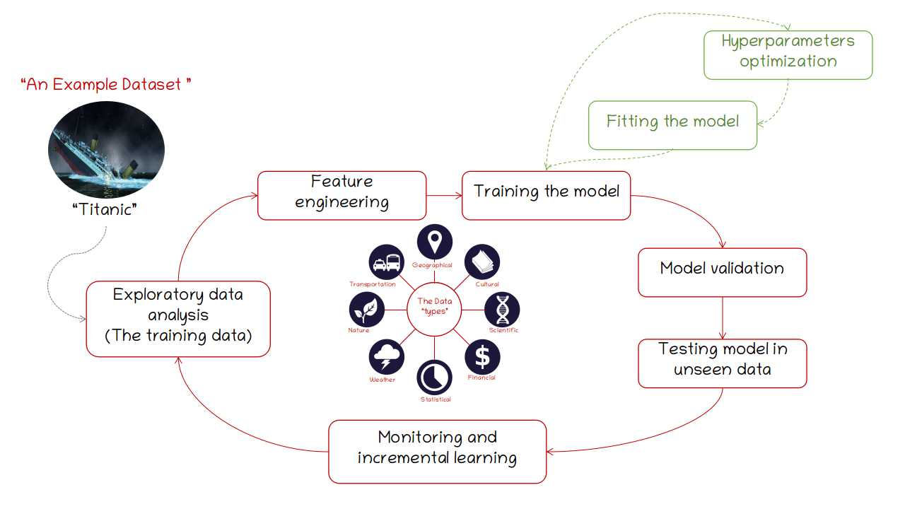
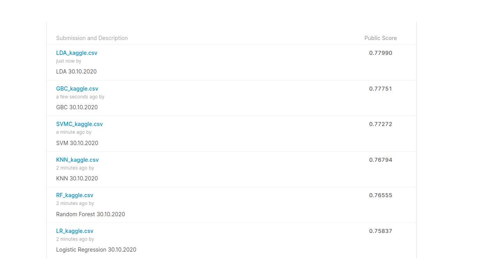

# `Machine Learning for classification tasks (ML_classification) `:
#### Supervised learning using the Titanic data set.

There are many different machine learning (ML) systems. Based on their purposes and features, they are classified in different types: Superivised-, unsupervised-, semisupervised-, and reinforcement- learning (Geron, 2019).

In the case of Supervised ML, a typical task is classification. In such ML task an algorithm is trained, "fed", with the data and the desired solutions.

This image represents a  basic pipeline for a supervised ML automation and evaluation process.

Note: Image adapted from wikipedia: https://en.wikipedia.org/wiki/Data#/media/File:Data_types_-_en.svg

In the ML_classification_titanic we are using a very popular dataset from Kaggle. Here, we used the training set from the `Titanic: Machine learning from Disaster` from Kaggle to fine six of the most important supervised ML algorithms:
- Logistic Regression (LR)
- RandomForestClassifier (RF): A meta estimator  to fit a n number of decision tree classifiers on various sub-samples of the data set.
- K neighbors (KNN)
- Support Vector Machines (SVM)
- Gradient Boosting (GBC)
- Linear Discriminant Analysis (LDA)

`The pipeline includes the following steps:`

1. Data Exploratory Analysis (DEA): Approach to analyzing the raw data set to identify and summarize the main characteristics using visualization methods.

2. Feature engineering: Using domain specific knowledge, or learning from the DEA step, to extract features form the data. The way these features are extracted can remarkably improve the performance of the ML algorithms.

3. Training the model (Evaluating classifiers): Measuring the performance achieved by a ML algorithm by considering the performance of a classifier on an independent test set.  
  * Strategy definition
  * Accuracy
  * Precision
  * Recall
  * F1 scores
  * Cross-validation

4. Hyperparameters optimization: Choosing a set of optimal parameters for a learning algorithm using exhaustive search over specified parameters for estimators (GridSearchCV). Here we will use all models mentioned above.
  * Logistic Regression
  * RandomForestClassifier: A meta estimator  to fit a n number of decision tree classifiers on various sub-samples of the dataset
  * Support Vector Machines
  * K neighbors
  * Gradient Boosting
  * Linear Discriminant Analysis

#### The submissions to Kaggle suggest very similar performance, although LDA, GBC, SVMC occupied the top three positions.

References:
Aurélien Géron. 2019. Hands-On Machine Learning with Scikit-Learn, Keras, and TensorFlow, 2nd Edition.O'Reilly Media
